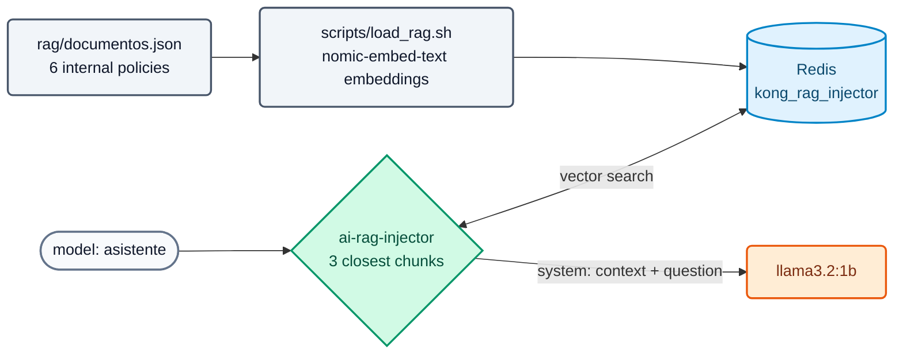

# AI Lab 05: Gateway-managed RAG

In this lab you will publish the `asistente` model, which answers using **Banco Demo's internal policies** thanks to the `ai-rag-injector` policy: the gateway looks up the relevant chunks in Redis and injects them into the prompt. The application does not change.



## Objectives

- Understand how a knowledge base is loaded for the gateway.
- Compare the same question without RAG (`chat`) and with RAG (`asistente`).
- See the injected context in Analytics.
- Exercise: adjust the number of chunks and tighten the template.

---

## Step 1: The knowledge base

The setup already loaded the documents. Review what they contain and how they ended up in Redis:

```bash
jq -r '.[].title' workshop-assets/dia-4/rag/documentos.json
docker exec aigw-lab-redis redis-cli --scan --pattern 'kong_rag_injector:*' | wc -l          # 6
K=$(docker exec aigw-lab-redis redis-cli --scan --pattern 'kong_rag_injector:*' | head -1)
docker exec aigw-lab-redis redis-cli JSON.GET "$K" '$.metadata'
```

If the base is empty, load it again:

```bash
./workshop-assets/dia-4/scripts/load_rag.sh
```

**Expected result:** `[OK] 6 embeddings (768 dimensiones)` and one `[OK]` line per document.

!!! info "What load_rag.sh does"
    It reads `documentos.json`, asks Ollama for the embeddings (`POST /api/embed` with `nomic-embed-text`) and stores each document in Redis as JSON (`payload`, `vector`, `metadata`) with the `kong_rag_injector:` prefix, which is the policy's `vectordb_namespace`. Model and dimensions **must match** the policy.

## Step 2: Review the configuration and apply

`workshop-assets/dia-4/config/lab_05_rag.yaml`: policy `rag-banco` (`fetch_chunks_count: 3`, `inject_as_role: system`, template with `<CONTEXT>` and `<PROMPT>`) attached to the `asistente` model.

```bash
./workshop-assets/dia-4/scripts/aplicar.sh 05
source ~/.kong-workshop/aigw-lab/.env.generated
preguntar() {  # preguntar <model> "<text>"
  curl -s http://localhost:8010/v1/chat/completions -H "apikey: $AIGW_KEY_EQUIPO_DATOS" -H "Content-Type: application/json" \
    -d "$(jq -cn --arg m "$1" --arg p "$2" '{model:$m,messages:[{role:"user",content:$p}]}')" | jq -r '.choices[0].message.content // .'
}
```

## Step 3: Without RAG vs. with RAG

```bash
Q="¿Cuál es el límite por operación para transferencias entre las 22:00 y las 06:00 en el Banco Demo?"
echo "== chat (sin RAG)";  preguntar chat "$Q"
echo "== asistente (RAG)"; preguntar asistente "$Q"
```

**Expected result:**

- `chat`: a generic or made-up answer (the model does not know Banco Demo).
- `asistente`: mentions **USD 1,000** per transaction in that time window (data from the "Política de transferencias" (transfer policy) document).

Try other questions covered by the documents:

```bash
preguntar asistente "¿Cuánto cuesta al año la tarjeta Platinum y cuándo se bonifica?"
preguntar asistente "¿Puedo enviar datos de clientes a un proveedor de IA externo?"
preguntar asistente "¿Qué score de buró mínimo exige el banco para un préstamo personal?"
```

**Expected result:** USD 180 (waived with spending > USD 2,000/month); only with prior anonymization in the AI Gateway; minimum score 650.

## Step 4: See the injected context

In Konnect → **AI Gateway** → **Analytics** (the `asistente` model has `logging.payloads: true`), open a recent request: the `system` message contains the template with the retrieved chunks. The app only sent the question.

## Step 5: Exercise

Edit `lab_05_rag.yaml`:

1. Fetch **2** chunks instead of 3 (`fetch_chunks_count`).
2. Change the template so that, if the answer is not in the context, the assistant replies exactly: **"No tengo esa información en las políticas internas."** ("I don't have that information in the internal policies.")

Apply and test with a question outside the knowledge base:

```bash
preguntar asistente "¿Cuál es la tasa de un plazo fijo a 30 días?"
```

**Expected result:** "No tengo esa información en las políticas internas." (with small models the wording may vary slightly; with a frontier model it is met consistently).

??? tip "Solution"
    `workshop-assets/dia-4/soluciones/lab_05_rag.yaml`:
    ```yaml
    fetch_chunks_count: 2
    inject_template: |-
      Usa SOLO el siguiente contexto de documentos internos del Banco Demo para responder.
      Si la respuesta no está en el contexto, responde exactamente:
      "No tengo esa información en las políticas internas."
      <CONTEXT>
      <PROMPT>
    ```
    `./workshop-assets/dia-4/scripts/aplicar.sh 05 --solucion`

---

## Conclusion

Corporate knowledge is governed in the gateway: which knowledge base, which models and which consumers use it, without each application building its own RAG. With local embeddings and a local model, neither the documents nor the questions leave the network. Theory: [AI Module 05](../dia-3-ai-gateway-teoria-y-demos/05-rag/Guia_IA_05_RAG_Gestionado.md). Next: [AI Lab 06 — MCP](Lab_IA_06_MCP.md).
