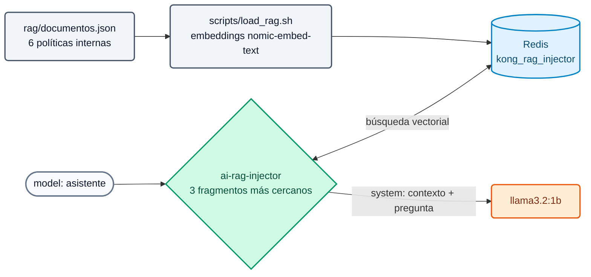

# Lab IA 05: RAG gestionado por el gateway

En este laboratorio publicarás el modelo `asistente`, que responde con las **políticas internas del Banco Demo** gracias a la policy `ai-rag-injector`: el gateway busca los fragmentos relevantes en Redis y los inyecta en el prompt. La aplicación no cambia.



## Objetivos

- Entender cómo se carga una base de conocimiento para el gateway.
- Comparar la misma pregunta sin RAG (`chat`) y con RAG (`asistente`).
- Ver el contexto inyectado en Analytics.
- Ejercicio: ajustar la cantidad de fragmentos y endurecer la plantilla.

---

## Paso 1: La base de conocimiento

El setup ya cargó los documentos. Revisa qué contienen y cómo quedaron en Redis:

```bash
jq -r '.[].title' workshop-assets/dia-4/rag/documentos.json
docker exec aigw-lab-redis redis-cli --scan --pattern 'kong_rag_injector:*' | wc -l          # 6
K=$(docker exec aigw-lab-redis redis-cli --scan --pattern 'kong_rag_injector:*' | head -1)
docker exec aigw-lab-redis redis-cli JSON.GET "$K" '$.metadata'
```

Si la base está vacía, cárgala de nuevo:

```bash
./workshop-assets/dia-4/scripts/load_rag.sh
```

**Resultado esperado:** `[OK] 6 embeddings (768 dimensiones)` y una línea `[OK]` por documento.

!!! info "Qué hace load_rag.sh"
    Lee `documentos.json`, pide a Ollama los embeddings (`POST /api/embed` con `nomic-embed-text`) y guarda cada documento en Redis como JSON (`payload`, `vector`, `metadata`) con el prefijo `kong_rag_injector:`, que es el `vectordb_namespace` de la policy. Modelo y dimensiones **deben coincidir** con la policy.

## Paso 2: Revisar la configuración y aplicar

`workshop-assets/dia-4/config/lab_05_rag.yaml`: policy `rag-banco` (`fetch_chunks_count: 3`, `inject_as_role: system`, plantilla con `<CONTEXT>` y `<PROMPT>`) asociada al modelo `asistente`.

```bash
./workshop-assets/dia-4/scripts/aplicar.sh 05
source ~/.kong-workshop/aigw-lab/.env.generated
preguntar() {  # preguntar <modelo> "<texto>"
  curl -s http://localhost:8010/v1/chat/completions -H "apikey: $AIGW_KEY_EQUIPO_DATOS" -H "Content-Type: application/json" \
    -d "$(jq -cn --arg m "$1" --arg p "$2" '{model:$m,messages:[{role:"user",content:$p}]}')" | jq -r '.choices[0].message.content // .'
}
```

## Paso 3: Sin RAG vs. con RAG

```bash
Q="¿Cuál es el límite por operación para transferencias entre las 22:00 y las 06:00 en el Banco Demo?"
echo "== chat (sin RAG)";  preguntar chat "$Q"
echo "== asistente (RAG)"; preguntar asistente "$Q"
```

**Resultado esperado:**

- `chat`: una respuesta genérica o inventada (el modelo no conoce al Banco Demo).
- `asistente`: menciona **USD 1.000** por operación en ese horario (dato del documento "Política de transferencias").

Prueba otras preguntas cubiertas por los documentos:

```bash
preguntar asistente "¿Cuánto cuesta al año la tarjeta Platinum y cuándo se bonifica?"
preguntar asistente "¿Puedo enviar datos de clientes a un proveedor de IA externo?"
preguntar asistente "¿Qué score de buró mínimo exige el banco para un préstamo personal?"
```

**Resultado esperado:** USD 180 (bonificada con consumos > USD 2.000/mes); sólo con anonimización previa en el AI Gateway; score mínimo 650.

## Paso 4: Ver el contexto inyectado

En Konnect → **AI Gateway** → **Analytics** (el modelo `asistente` tiene `logging.payloads: true`), abre una petición reciente: el mensaje `system` contiene la plantilla con los fragmentos recuperados. La app sólo envió la pregunta.

## Paso 5: Ejercicio

Edita `lab_05_rag.yaml`:

1. Trae **2** fragmentos en lugar de 3 (`fetch_chunks_count`).
2. Cambia la plantilla para que, si la respuesta no está en el contexto, el asistente responda exactamente: **"No tengo esa información en las políticas internas."**

Aplica y prueba con una pregunta fuera de la base:

```bash
preguntar asistente "¿Cuál es la tasa de un plazo fijo a 30 días?"
```

**Resultado esperado:** "No tengo esa información en las políticas internas." (con modelos pequeños la frase puede variar levemente; con un modelo frontier se cumple de forma consistente).

??? tip "Solución"
    `workshop-assets/dia-4/soluciones/lab_05_rag.yaml`:
    ```yaml
    fetch_chunks_count: 2
    inject_template: |-
      Usa SOLO el siguiente contexto de documentos internos del Banco Demo para responder.
      Si la respuesta no está en el contexto, responde exactamente:
      "No tengo esa información en las políticas internas."
      <CONTEXT>
      <PROMPT>
    ```
    `./workshop-assets/dia-4/scripts/aplicar.sh 05 --solucion`

---

## Conclusión

El conocimiento corporativo se gobierna en el gateway: qué base, qué modelos y qué consumidores la usan, sin que cada aplicación construya su propio RAG. Con embeddings y modelo locales, ni los documentos ni las preguntas salen de la red. Teoría: [Módulo IA 05](../dia-3-ai-gateway-teoria-y-demos/05-rag/Guia_IA_05_RAG_Gestionado.md). Siguiente: [Lab IA 06 — MCP](Lab_IA_06_MCP.md).
