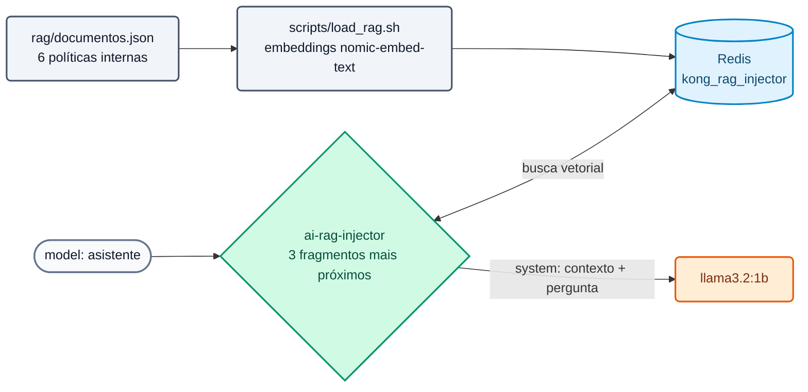

# Lab IA 05: RAG gerenciado pelo gateway

Neste laboratório você vai publicar o modelo `asistente`, que responde com as **políticas internas do Banco Demo** graças à policy `ai-rag-injector`: o gateway busca os fragmentos relevantes no Redis e os injeta no prompt. A aplicação não muda.



## Objetivos

- Entender como uma base de conhecimento é carregada para o gateway.
- Comparar a mesma pergunta sem RAG (`chat`) e com RAG (`asistente`).
- Ver o contexto injetado no Analytics.
- Exercício: ajustar a quantidade de fragmentos e endurecer o template.

---

## Passo 1: A base de conhecimento

O setup já carregou os documentos. Veja o que eles contêm e como ficaram no Redis:

```bash
jq -r '.[].title' workshop-assets/dia-4/rag/documentos.json
docker exec aigw-lab-redis redis-cli --scan --pattern 'kong_rag_injector:*' | wc -l          # 6
K=$(docker exec aigw-lab-redis redis-cli --scan --pattern 'kong_rag_injector:*' | head -1)
docker exec aigw-lab-redis redis-cli JSON.GET "$K" '$.metadata'
```

Se a base estiver vazia, carregue-a novamente:

```bash
./workshop-assets/dia-4/scripts/load_rag.sh
```

**Resultado esperado:** `[OK] 6 embeddings (768 dimensiones)` e uma linha `[OK]` por documento.

!!! info "O que o load_rag.sh faz"
    Ele lê `documentos.json`, pede ao Ollama os embeddings (`POST /api/embed` com `nomic-embed-text`) e grava cada documento no Redis como JSON (`payload`, `vector`, `metadata`) com o prefixo `kong_rag_injector:`, que é o `vectordb_namespace` da policy. Modelo e dimensões **devem coincidir** com os da policy.

## Passo 2: Revisar a configuração e aplicar

`workshop-assets/dia-4/config/lab_05_rag.yaml`: policy `rag-banco` (`fetch_chunks_count: 3`, `inject_as_role: system`, template com `<CONTEXT>` e `<PROMPT>`) associada ao modelo `asistente`.

```bash
./workshop-assets/dia-4/scripts/aplicar.sh 05
source ~/.kong-workshop/aigw-lab/.env.generated
preguntar() {  # preguntar <modelo> "<texto>"
  curl -s http://localhost:8010/v1/chat/completions -H "apikey: $AIGW_KEY_EQUIPO_DATOS" -H "Content-Type: application/json" \
    -d "$(jq -cn --arg m "$1" --arg p "$2" '{model:$m,messages:[{role:"user",content:$p}]}')" | jq -r '.choices[0].message.content // .'
}
```

## Passo 3: Sem RAG vs. com RAG

```bash
Q="¿Cuál es el límite por operación para transferencias entre las 22:00 y las 06:00 en el Banco Demo?"
echo "== chat (sin RAG)";  preguntar chat "$Q"
echo "== asistente (RAG)"; preguntar asistente "$Q"
```

**Resultado esperado:**

- `chat`: uma resposta genérica ou inventada (o modelo não conhece o Banco Demo).
- `asistente`: menciona **USD 1.000** por operação nesse horário (dado do documento "Política de transferencias").

Teste outras perguntas cobertas pelos documentos:

```bash
preguntar asistente "¿Cuánto cuesta al año la tarjeta Platinum y cuándo se bonifica?"
preguntar asistente "¿Puedo enviar datos de clientes a un proveedor de IA externo?"
preguntar asistente "¿Qué score de buró mínimo exige el banco para un préstamo personal?"
```

**Resultado esperado:** USD 180 (isenta com gastos > USD 2.000/mês); somente com anonimização prévia no AI Gateway; score mínimo 650.

## Passo 4: Ver o contexto injetado

No Konnect → **AI Gateway** → **Analytics** (o modelo `asistente` tem `logging.payloads: true`), abra uma requisição recente: a mensagem `system` contém o template com os fragmentos recuperados. A app enviou apenas a pergunta.

## Passo 5: Exercício

Edite `lab_05_rag.yaml`:

1. Traga **2** fragmentos em vez de 3 (`fetch_chunks_count`).
2. Altere o template para que, se a resposta não estiver no contexto, o assistente responda exatamente: **"No tengo esa información en las políticas internas."** (não tenho essa informação nas políticas internas).

Aplique e teste com uma pergunta fora da base:

```bash
preguntar asistente "¿Cuál es la tasa de un plazo fijo a 30 días?"
```

**Resultado esperado:** "No tengo esa información en las políticas internas." (com modelos pequenos a frase pode variar levemente; com um modelo frontier isso se cumpre de forma consistente).

??? tip "Solução"
    `workshop-assets/dia-4/soluciones/lab_05_rag.yaml`:
    ```yaml
    fetch_chunks_count: 2
    inject_template: |-
      Usa SOLO el siguiente contexto de documentos internos del Banco Demo para responder.
      Si la respuesta no está en el contexto, responde exactamente:
      "No tengo esa información en las políticas internas."
      <CONTEXT>
      <PROMPT>
    ```
    `./workshop-assets/dia-4/scripts/aplicar.sh 05 --solucion`

---

## Conclusão

O conhecimento corporativo é governado no gateway: qual base, quais modelos e quais consumidores a utilizam, sem que cada aplicação construa o seu próprio RAG. Com embeddings e modelo locais, nem os documentos nem as perguntas saem da rede. Teoria: [Módulo IA 05](../dia-3-ai-gateway-teoria-y-demos/05-rag/Guia_IA_05_RAG_Gestionado.md). Próximo: [Lab IA 06 — MCP](Lab_IA_06_MCP.md).
