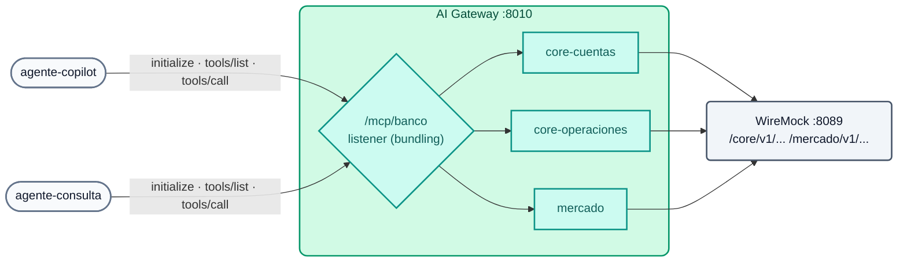

# AI Lab 06: MCP — REST APIs as tools, bundling and per-agent ACL

In this lab you will turn the "core banking" REST APIs (simulated with WireMock) into **MCP tools** without writing any MCP server, group them into **a single endpoint** (`/mcp/banco`), and verify that each agent **sees and runs only** the tools its group allows.



## Objectives

- Declare `conversion-only` MCP servers from REST APIs.
- Group them with a `listener` server (MCP Server Bundling).
- Apply default ACLs and per-tool ACLs.
- Run the MCP cycle (`initialize`, `tools/list`, `tools/call`) with a minimal client.
- Exercise: publish a new API as a tool.

---

## Step 1: The original APIs (REST, not MCP)

```bash
curl -s http://localhost:8089/core/v1/cuentas/1001 | jq .
curl -s http://localhost:8089/core/v1/cuentas/1001/transacciones | jq '.transacciones[0]'
curl -s http://localhost:8089/mercado/v1/tipo-cambio | jq .
```

These are regular REST APIs (WireMock simulates the core). Nobody wrote an MCP server.

## Step 2: Review the configuration

`workshop-assets/dia-4/config/lab_06_mcp.yaml`:

| Server | Type | Tools | ACL |
| :--- | :--- | :--- | :--- |
| `core-cuentas` | `conversion-only` | `consultar_cuenta`, `listar_transacciones` | bundle default |
| `core-operaciones` | `conversion-only` | `bloquear_cuenta` (destructive) | **`agentes-operaciones` only** |
| `mercado` | `conversion-only` | `tipo_de_cambio` | bundle default |
| `banco-mcp` | `listener` on `/mcp/banco` | the 4 above (`sources`) | `default_tool_acls.allow: [agentes-operaciones, agentes-lectura]` |

Each tool defines `method`, `path`, `parameters` (`in: path`...) and `annotations` (`read_only_hint`, `destructive_hint`). The listener has `logging: {payloads: true, audits: true}`.

## Step 3: Apply

```bash
./workshop-assets/dia-4/scripts/aplicar.sh 06
source ~/.kong-workshop/aigw-lab/.env.generated
MCP=http://localhost:8010/mcp/banco
mcp() { python3 workshop-assets/dia-4/scripts/mcp_client.py "$@"; }
```

`mcp_client.py` is a minimal MCP client (Streamable HTTP, JSON-RPC, Python standard library only): it performs `initialize`, `notifications/initialized` and then `tools/list` or `tools/call`, and prints one JSON line.

## Step 4: Protected endpoint

```bash
mcp $MCP "" list
```

**Expected result:** `{"http": 401, ...}`.

## Step 5: Bundling and per-profile visibility

```bash
mcp $MCP "$AIGW_KEY_AGENTE_COPILOT" list | jq -c .tools
mcp $MCP "$AIGW_KEY_AGENTE_CONSULTA" list | jq -c .tools
mcp $MCP "$AIGW_KEY_APP_WEB" list | jq -c '{http, tools}'
```

**Expected result:**

| Consumer | Visible tools |
| :--- | :--- |
| `agente-copilot` (agentes-operaciones) | `consultar_cuenta`, `listar_transacciones`, `bloquear_cuenta`, `tipo_de_cambio` (4) |
| `agente-consulta` (agentes-lectura) | `consultar_cuenta`, `listar_transacciones`, `tipo_de_cambio` (3) |
| `app-web` (no agent group) | no tools (empty list or rejection) |

## Step 6: Run tools

```bash
mcp $MCP "$AIGW_KEY_AGENTE_CONSULTA" call listar_transacciones '{"cuenta_id":"1001"}' | jq -r '.result.content[0].text' | head -20
mcp $MCP "$AIGW_KEY_AGENTE_CONSULTA" call bloquear_cuenta '{"cuenta_id":"1001"}' | jq -c '{http, error, isError: .result.isError}'
mcp $MCP "$AIGW_KEY_AGENTE_COPILOT"  call bloquear_cuenta '{"cuenta_id":"1001"}' | jq -r '.result.content[0].text'
```

**Expected result:**

1. `agente-consulta` lists the transactions (includes `tx-9001`, USD 5,500 to a new account at 23:41).
2. `agente-consulta` **cannot** run `bloquear_cuenta` (`403`, `error` or `isError: true`).
3. `agente-copilot` runs it: `"resultado": "BLOQUEADA"`.

In Konnect → **Analytics** you will see each *tool call* with consumer, tool and payload (audit trail).

## Step 7: Exercise

WireMock already exposes an API that is not a tool yet:

```bash
curl -s http://localhost:8089/core/v1/clientes/C-001/tarjetas | jq .
```

Publish it as a new **read-only** tool named **`listar_tarjetas`** inside the `core-cuentas` server (method `GET`, path `/core/v1/clientes/{cliente_id}/tarjetas`, parameter `cliente_id` in the path). Apply and verify:

```bash
mcp $MCP "$AIGW_KEY_AGENTE_CONSULTA" list | jq -c .tools                 # now 4 tools
mcp $MCP "$AIGW_KEY_AGENTE_CONSULTA" call listar_tarjetas '{"cliente_id":"C-001"}' | jq -r '.result.content[0].text'
```

**Expected result:** the cards with a **masked** number. It inherits the default ACL: both agents can see it.

??? tip "Solution"
    `workshop-assets/dia-4/soluciones/lab_06_mcp.yaml`:
    ```yaml
    - name: listar_tarjetas
      description: Lista las tarjetas de un cliente (número enmascarado, tipo, estado y límite).
      method: GET
      path: /core/v1/clientes/{cliente_id}/tarjetas
      annotations: {title: Listar tarjetas, read_only_hint: true, destructive_hint: false}
      parameters:
        - {name: cliente_id, in: path, required: true, description: Identificador del cliente, schema: {type: string}}
    ```
    `./workshop-assets/dia-4/scripts/aplicar.sh 06 --solucion`

## Step 8 (optional): Connect a real MCP client

If you use Claude Code, Cursor or another MCP client with HTTP transport, point it at the gateway with the agent's API key:

```bash
claude mcp add --transport http banco http://localhost:8010/mcp/banco --header "apikey: $AIGW_KEY_AGENTE_CONSULTA"
```

Ask the assistant: *"Lista las transacciones de la cuenta 1001 y dime si alguna parece sospechosa"* (list the transactions of account 1001 and tell me if any look suspicious). It will not be able to block the account: that tool does not exist for its profile.

---

## Conclusion

The APIs the bank already governs become MCP tools through declarative configuration; the gateway adds identity, per-tool ACLs and auditing, plus a single endpoint per profile. Theory: [AI Module 06](../dia-3-ai-gateway-teoria-y-demos/06-mcp/Guia_IA_06_MCP.md). Next: [AI Lab 07 — A2A](Lab_IA_07_A2A.md).
