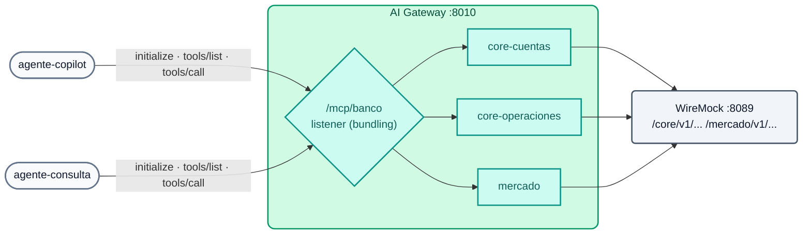

# Lab IA 06: MCP — APIs REST como tools, bundling y ACL por agente

En este laboratorio convertirás las APIs REST del "core bancario" (simuladas con WireMock) en **tools MCP** sin escribir ningún servidor MCP, las agruparás en **un único endpoint** (`/mcp/banco`) y comprobarás que cada agente **ve y ejecuta sólo** las tools que su grupo permite.



## Objetivos

- Declarar servidores MCP `conversion-only` a partir de APIs REST.
- Agruparlos con un servidor `listener` (MCP Server Bundling).
- Aplicar ACL por defecto y ACL por tool.
- Ejecutar el ciclo MCP (`initialize`, `tools/list`, `tools/call`) con un cliente mínimo.
- Ejercicio: publicar una API nueva como tool.

---

## Paso 1: Las APIs originales (REST, no MCP)

```bash
curl -s http://localhost:8089/core/v1/cuentas/1001 | jq .
curl -s http://localhost:8089/core/v1/cuentas/1001/transacciones | jq '.transacciones[0]'
curl -s http://localhost:8089/mercado/v1/tipo-cambio | jq .
```

Son APIs REST normales (WireMock simula el core). Nadie escribió un servidor MCP.

## Paso 2: Revisar la configuración

`workshop-assets/dia-4/config/lab_06_mcp.yaml`:

| Servidor | Tipo | Tools | ACL |
| :--- | :--- | :--- | :--- |
| `core-cuentas` | `conversion-only` | `consultar_cuenta`, `listar_transacciones` | por defecto del bundle |
| `core-operaciones` | `conversion-only` | `bloquear_cuenta` (destructiva) | **sólo `agentes-operaciones`** |
| `mercado` | `conversion-only` | `tipo_de_cambio` | por defecto del bundle |
| `banco-mcp` | `listener` en `/mcp/banco` | las 4 anteriores (`sources`) | `default_tool_acls.allow: [agentes-operaciones, agentes-lectura]` |

Cada tool define `method`, `path`, `parameters` (`in: path`...) y `annotations` (`read_only_hint`, `destructive_hint`). El listener tiene `logging: {payloads: true, audits: true}`.

## Paso 3: Aplicar

```bash
./workshop-assets/dia-4/scripts/aplicar.sh 06
source ~/.kong-workshop/aigw-lab/.env.generated
MCP=http://localhost:8010/mcp/banco
mcp() { python3 workshop-assets/dia-4/scripts/mcp_client.py "$@"; }
```

`mcp_client.py` es un cliente MCP mínimo (Streamable HTTP, JSON-RPC, sólo biblioteca estándar de Python): hace `initialize`, `notifications/initialized` y luego `tools/list` o `tools/call`, e imprime una línea JSON.

## Paso 4: Endpoint protegido

```bash
mcp $MCP "" list
```

**Resultado esperado:** `{"http": 401, ...}`.

## Paso 5: Bundling y visibilidad por perfil

```bash
mcp $MCP "$AIGW_KEY_AGENTE_COPILOT" list | jq -c .tools
mcp $MCP "$AIGW_KEY_AGENTE_CONSULTA" list | jq -c .tools
mcp $MCP "$AIGW_KEY_APP_WEB" list | jq -c '{http, tools}'
```

**Resultado esperado:**

| Consumer | Tools visibles |
| :--- | :--- |
| `agente-copilot` (agentes-operaciones) | `consultar_cuenta`, `listar_transacciones`, `bloquear_cuenta`, `tipo_de_cambio` (4) |
| `agente-consulta` (agentes-lectura) | `consultar_cuenta`, `listar_transacciones`, `tipo_de_cambio` (3) |
| `app-web` (sin grupo de agentes) | ninguna tool (lista vacía o rechazo) |

## Paso 6: Ejecutar tools

```bash
mcp $MCP "$AIGW_KEY_AGENTE_CONSULTA" call listar_transacciones '{"cuenta_id":"1001"}' | jq -r '.result.content[0].text' | head -20
mcp $MCP "$AIGW_KEY_AGENTE_CONSULTA" call bloquear_cuenta '{"cuenta_id":"1001"}' | jq -c '{http, error, isError: .result.isError}'
mcp $MCP "$AIGW_KEY_AGENTE_COPILOT"  call bloquear_cuenta '{"cuenta_id":"1001"}' | jq -r '.result.content[0].text'
```

**Resultado esperado:**

1. `agente-consulta` lista las transacciones (incluye `tx-9001`, USD 5.500 a una cuenta nueva a las 23:41).
2. `agente-consulta` **no puede** ejecutar `bloquear_cuenta` (`403`, `error` o `isError: true`).
3. `agente-copilot` la ejecuta: `"resultado": "BLOQUEADA"`.

En Konnect → **Analytics** verás cada *tool call* con consumer, tool y payload (auditoría).

## Paso 7: Ejercicio

WireMock ya expone una API que todavía no es tool:

```bash
curl -s http://localhost:8089/core/v1/clientes/C-001/tarjetas | jq .
```

Publícala como una nueva tool **de solo lectura** llamada **`listar_tarjetas`** dentro del servidor `core-cuentas` (método `GET`, path `/core/v1/clientes/{cliente_id}/tarjetas`, parámetro `cliente_id` en el path). Aplica y verifica:

```bash
mcp $MCP "$AIGW_KEY_AGENTE_CONSULTA" list | jq -c .tools                 # ahora 4 tools
mcp $MCP "$AIGW_KEY_AGENTE_CONSULTA" call listar_tarjetas '{"cliente_id":"C-001"}' | jq -r '.result.content[0].text'
```

**Resultado esperado:** las tarjetas con número **enmascarado**. Hereda la ACL por defecto: la ven los dos agentes.

??? tip "Solución"
    `workshop-assets/dia-4/soluciones/lab_06_mcp.yaml`:
    ```yaml
    - name: listar_tarjetas
      description: Lista las tarjetas de un cliente (número enmascarado, tipo, estado y límite).
      method: GET
      path: /core/v1/clientes/{cliente_id}/tarjetas
      annotations: {title: Listar tarjetas, read_only_hint: true, destructive_hint: false}
      parameters:
        - {name: cliente_id, in: path, required: true, description: Identificador del cliente, schema: {type: string}}
    ```
    `./workshop-assets/dia-4/scripts/aplicar.sh 06 --solucion`

## Paso 8 (opcional): Conectar un cliente MCP real

Si usas Claude Code, Cursor u otro cliente MCP con transporte HTTP, apúntalo al gateway con la API key del agente:

```bash
claude mcp add --transport http banco http://localhost:8010/mcp/banco --header "apikey: $AIGW_KEY_AGENTE_CONSULTA"
```

Pide al asistente: *"Lista las transacciones de la cuenta 1001 y dime si alguna parece sospechosa"*. No podrá bloquear la cuenta: esa tool no existe para su perfil.

---

## Conclusión

Las APIs que el banco ya gobierna se convierten en tools MCP con configuración declarativa; el gateway agrega identidad, ACL por tool y auditoría, y un único endpoint por perfil. Teoría: [Módulo IA 06](../dia-3-ai-gateway-teoria-y-demos/06-mcp/Guia_IA_06_MCP.md). Siguiente: [Lab IA 07 — A2A](Lab_IA_07_A2A.md).
