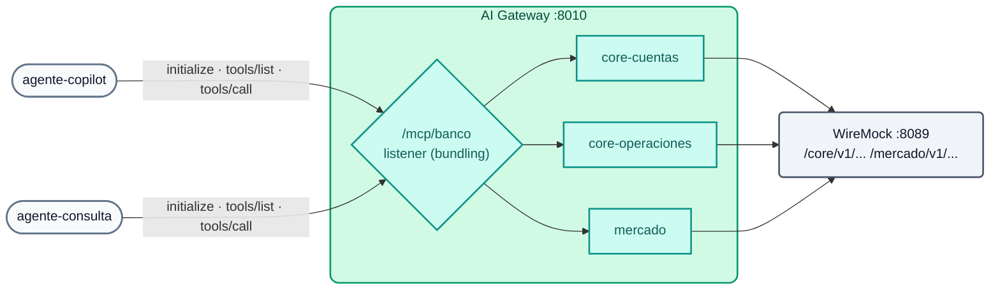

# Lab IA 06: MCP — APIs REST como tools, bundling e ACL por agente

Neste laboratório você vai converter as APIs REST do "core bancário" (simuladas com WireMock) em **tools MCP** sem escrever nenhum servidor MCP, agrupá-las em **um único endpoint** (`/mcp/banco`) e comprovar que cada agente **vê e executa apenas** as tools que o seu grupo permite.



## Objetivos

- Declarar servidores MCP `conversion-only` a partir de APIs REST.
- Agrupá-los com um servidor `listener` (MCP Server Bundling).
- Aplicar ACL padrão e ACL por tool.
- Executar o ciclo MCP (`initialize`, `tools/list`, `tools/call`) com um cliente mínimo.
- Exercício: publicar uma nova API como tool.

---

## Passo 1: As APIs originais (REST, não MCP)

```bash
curl -s http://localhost:8089/core/v1/cuentas/1001 | jq .
curl -s http://localhost:8089/core/v1/cuentas/1001/transacciones | jq '.transacciones[0]'
curl -s http://localhost:8089/mercado/v1/tipo-cambio | jq .
```

São APIs REST normais (o WireMock simula o core). Ninguém escreveu um servidor MCP.

## Passo 2: Revisar a configuração

`workshop-assets/dia-4/config/lab_06_mcp.yaml`:

| Servidor | Tipo | Tools | ACL |
| :--- | :--- | :--- | :--- |
| `core-cuentas` | `conversion-only` | `consultar_cuenta`, `listar_transacciones` | padrão do bundle |
| `core-operaciones` | `conversion-only` | `bloquear_cuenta` (destrutiva) | **apenas `agentes-operaciones`** |
| `mercado` | `conversion-only` | `tipo_de_cambio` | padrão do bundle |
| `banco-mcp` | `listener` em `/mcp/banco` | as 4 anteriores (`sources`) | `default_tool_acls.allow: [agentes-operaciones, agentes-lectura]` |

Cada tool define `method`, `path`, `parameters` (`in: path`...) e `annotations` (`read_only_hint`, `destructive_hint`). O listener tem `logging: {payloads: true, audits: true}`.

## Passo 3: Aplicar

```bash
./workshop-assets/dia-4/scripts/aplicar.sh 06
source ~/.kong-workshop/aigw-lab/.env.generated
MCP=http://localhost:8010/mcp/banco
mcp() { python3 workshop-assets/dia-4/scripts/mcp_client.py "$@"; }
```

`mcp_client.py` é um cliente MCP mínimo (Streamable HTTP, JSON-RPC, apenas biblioteca padrão do Python): ele faz `initialize`, `notifications/initialized` e depois `tools/list` ou `tools/call`, e imprime uma linha JSON.

## Passo 4: Endpoint protegido

```bash
mcp $MCP "" list
```

**Resultado esperado:** `{"http": 401, ...}`.

## Passo 5: Bundling e visibilidade por perfil

```bash
mcp $MCP "$AIGW_KEY_AGENTE_COPILOT" list | jq -c .tools
mcp $MCP "$AIGW_KEY_AGENTE_CONSULTA" list | jq -c .tools
mcp $MCP "$AIGW_KEY_APP_WEB" list | jq -c '{http, tools}'
```

**Resultado esperado:**

| Consumer | Tools visíveis |
| :--- | :--- |
| `agente-copilot` (agentes-operaciones) | `consultar_cuenta`, `listar_transacciones`, `bloquear_cuenta`, `tipo_de_cambio` (4) |
| `agente-consulta` (agentes-lectura) | `consultar_cuenta`, `listar_transacciones`, `tipo_de_cambio` (3) |
| `app-web` (sem grupo de agentes) | nenhuma tool (lista vazia ou rejeição) |

## Passo 6: Executar tools

```bash
mcp $MCP "$AIGW_KEY_AGENTE_CONSULTA" call listar_transacciones '{"cuenta_id":"1001"}' | jq -r '.result.content[0].text' | head -20
mcp $MCP "$AIGW_KEY_AGENTE_CONSULTA" call bloquear_cuenta '{"cuenta_id":"1001"}' | jq -c '{http, error, isError: .result.isError}'
mcp $MCP "$AIGW_KEY_AGENTE_COPILOT"  call bloquear_cuenta '{"cuenta_id":"1001"}' | jq -r '.result.content[0].text'
```

**Resultado esperado:**

1. `agente-consulta` lista as transações (inclui `tx-9001`, USD 5.500 para uma conta nova às 23:41).
2. `agente-consulta` **não consegue** executar `bloquear_cuenta` (`403`, `error` ou `isError: true`).
3. `agente-copilot` a executa: `"resultado": "BLOQUEADA"`.

No Konnect → **Analytics** você verá cada *tool call* com consumer, tool e payload (auditoria).

## Passo 7: Exercício

O WireMock já expõe uma API que ainda não é tool:

```bash
curl -s http://localhost:8089/core/v1/clientes/C-001/tarjetas | jq .
```

Publique-a como uma nova tool **somente leitura** chamada **`listar_tarjetas`** dentro do servidor `core-cuentas` (método `GET`, path `/core/v1/clientes/{cliente_id}/tarjetas`, parâmetro `cliente_id` no path). Aplique e verifique:

```bash
mcp $MCP "$AIGW_KEY_AGENTE_CONSULTA" list | jq -c .tools                 # agora 4 tools
mcp $MCP "$AIGW_KEY_AGENTE_CONSULTA" call listar_tarjetas '{"cliente_id":"C-001"}' | jq -r '.result.content[0].text'
```

**Resultado esperado:** os cartões com número **mascarado**. A tool herda a ACL padrão: os dois agentes a veem.

??? tip "Solução"
    `workshop-assets/dia-4/soluciones/lab_06_mcp.yaml`:
    ```yaml
    - name: listar_tarjetas
      description: Lista las tarjetas de un cliente (número enmascarado, tipo, estado y límite).
      method: GET
      path: /core/v1/clientes/{cliente_id}/tarjetas
      annotations: {title: Listar tarjetas, read_only_hint: true, destructive_hint: false}
      parameters:
        - {name: cliente_id, in: path, required: true, description: Identificador del cliente, schema: {type: string}}
    ```
    `./workshop-assets/dia-4/scripts/aplicar.sh 06 --solucion`

## Passo 8 (opcional): Conectar um cliente MCP real

Se você usa Claude Code, Cursor ou outro cliente MCP com transporte HTTP, aponte-o para o gateway com a API key do agente:

```bash
claude mcp add --transport http banco http://localhost:8010/mcp/banco --header "apikey: $AIGW_KEY_AGENTE_CONSULTA"
```

Peça ao assistente: *"Lista las transacciones de la cuenta 1001 y dime si alguna parece sospechosa"* (liste as transações da conta 1001 e diga se alguma parece suspeita). Ele não conseguirá bloquear a conta: essa tool não existe para o seu perfil.

---

## Conclusão

As APIs que o banco já governa se transformam em tools MCP com configuração declarativa; o gateway adiciona identidade, ACL por tool e auditoria, além de um único endpoint por perfil. Teoria: [Módulo IA 06](../dia-3-ai-gateway-teoria-y-demos/06-mcp/Guia_IA_06_MCP.md). Próximo: [Lab IA 07 — A2A](Lab_IA_07_A2A.md).
