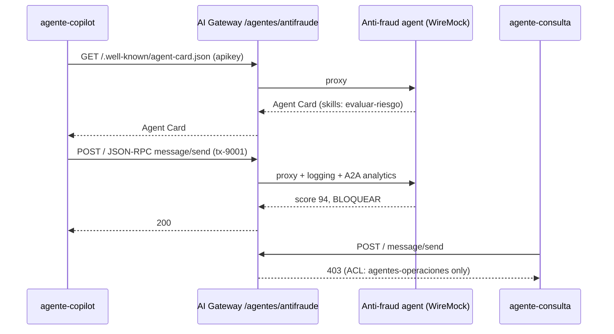

# AI Lab 07: A2A — one agent delegates to another through the gateway

In this lab you will publish the **anti-fraud agent** (A2A protocol, simulated with WireMock) behind the AI Gateway. The operations copilot will be able to discover it and delegate the assessment of a transfer to it; the query agent will not.



## Objectives

- Declare an `ai_gateway_agents` entity (`type: a2a`).
- Discover an agent through its **Agent Card** via the gateway.
- Invoke it with JSON-RPC (`message/send`).
- Verify authentication and ACLs between agents.
- Exercise: publish a second agent (credit scoring).

---

## Step 1: Review the configuration and apply

`workshop-assets/dia-4/config/lab_07_a2a.yaml`:

```yaml
ai_gateway_agents:
  - ref: agente-antifraude
    ai_gateway: !ref lab-ai-gw#id
    type: a2a
    name: agente-antifraude
    display_name: Agente antifraude (A2A)
    access:
      auth_strategies: [!ref lab-key-auth#name]
      acls:
        allow: [agentes-operaciones]
    config:
      url: http://wiremock:8080/antifraude/
      route:
        paths: [/agentes/antifraude]
      logging: {payloads: true, statistics: true}
```

```bash
./workshop-assets/dia-4/scripts/aplicar.sh 07
source ~/.kong-workshop/aigw-lab/.env.generated
A2A=http://localhost:8010/agentes/antifraude
SEND='{"jsonrpc":"2.0","id":"1","method":"message/send","params":{"message":{"role":"user","messageId":"m-1","parts":[{"kind":"text","text":"Evaluar transferencia tx-9001: USD 5.500 a cuenta creada hace 2 h, 23:41 h."}]}}}'
```

## Step 2: Discovery (Agent Card)

```bash
curl -s -H "apikey: $AIGW_KEY_AGENTE_COPILOT" "$A2A/.well-known/agent-card.json" | jq '{name, url, skills: [.skills[].id]}'
```

**Expected result:** `"name": "Agente Antifraude"` with the `evaluar-riesgo` skill.

## Step 3: Delegation

```bash
curl -s -X POST "$A2A/" -H "apikey: $AIGW_KEY_AGENTE_COPILOT" -H "Content-Type: application/json" -d "$SEND" \
  | jq '.result.parts[0].data'
```

**Expected result:**

```json
{
  "score_riesgo": 94,
  "recomendacion": "BLOQUEAR",
  "motivo": "Transferencia de alto monto a cuenta creada hace menos de 24 h, fuera del horario habitual del cliente."
}
```

## Step 4: Governing agent-to-agent traffic

```bash
curl -s -o /dev/null -w "sin credencial:   %{http_code}\n" -X POST "$A2A/" -H "Content-Type: application/json" -d "$SEND"
curl -s -o /dev/null -w "agente-consulta:  %{http_code}\n" -X POST "$A2A/" -H "apikey: $AIGW_KEY_AGENTE_CONSULTA" -H "Content-Type: application/json" -d "$SEND"
curl -s -o /dev/null -w "agente-copilot:   %{http_code}\n" -X POST "$A2A/" -H "apikey: $AIGW_KEY_AGENTE_COPILOT" -H "Content-Type: application/json" -d "$SEND"
```

**Expected result:** `401`, `403`, `200`.

In Konnect → **Analytics**: the A2A interactions appear with their consumer and statistics.

## Step 5: Combining MCP + A2A (copilot flow)

Simulate the full flow of an operations copilot (labs 06 and 07 must be applied):

```bash
mcp() { python3 workshop-assets/dia-4/scripts/mcp_client.py "$@"; }
# 1) READ (MCP): latest transactions
mcp http://localhost:8010/mcp/banco "$AIGW_KEY_AGENTE_COPILOT" call listar_transacciones '{"cuenta_id":"1001"}' | jq -r '.result.content[0].text' | head -8
# 2) DELEGATE (A2A): risk assessment
REC=$(curl -s -X POST "$A2A/" -H "apikey: $AIGW_KEY_AGENTE_COPILOT" -H "Content-Type: application/json" -d "$SEND" | jq -r '.result.parts[0].data.recomendacion')
echo "Recomendación antifraude: $REC"
# 3) ACT (MCP): block only if warranted
[ "$REC" = "BLOQUEAR" ] && mcp http://localhost:8010/mcp/banco "$AIGW_KEY_AGENTE_COPILOT" call bloquear_cuenta '{"cuenta_id":"1001"}' | jq -r '.result.content[0].text'
```

All three steps went through the gateway with the same identity (`agente-copilot`) and were audited.

## Step 6: Exercise

WireMock also simulates a **credit scoring agent** at `http://wiremock:8080/scoring/`:

```bash
curl -s http://localhost:8089/scoring/.well-known/agent-card.json | jq '{name, skills: [.skills[].id]}'
```

Publish it on the gateway at **`/agentes/scoring`**, accessible **only** to the **`plan-premium`** group. Apply and verify:

```bash
S=http://localhost:8010/agentes/scoring
SEND2='{"jsonrpc":"2.0","id":"2","method":"message/send","params":{"message":{"role":"user","messageId":"m-2","parts":[{"kind":"text","text":"Solicitud de préstamo personal USD 8.000 a 24 meses, ingreso neto USD 2.400."}]}}}'
curl -s -X POST "$S/" -H "apikey: $AIGW_KEY_EQUIPO_DATOS" -H "Content-Type: application/json" -d "$SEND2" | jq '.result.parts[0].data'   # 200
curl -s -o /dev/null -w "%{http_code}\n" -X POST "$S/" -H "apikey: $AIGW_KEY_APP_WEB" -H "Content-Type: application/json" -d "$SEND2"   # 403
```

??? tip "Solution"
    `workshop-assets/dia-4/soluciones/lab_07_a2a.yaml`:
    ```yaml
    - ref: agente-scoring
      ai_gateway: !ref lab-ai-gw#id
      type: a2a
      name: agente-scoring
      display_name: Agente de scoring crediticio (A2A)
      access:
        auth_strategies: [!ref lab-key-auth#name]
        acls:
          allow: [plan-premium]
      config:
        url: http://wiremock:8080/scoring/
        route:
          paths: [/agentes/scoring]
        logging: {payloads: true, statistics: true}
    ```
    `./workshop-assets/dia-4/scripts/aplicar.sh 07 --solucion`

---

## Conclusion

LLMs, MCP tools and A2A agents share the same control plane: identity, ACLs and auditing. No agent can delegate to another without explicit authorization. Theory: [AI Module 07](../dia-3-ai-gateway-teoria-y-demos/07-agentes-a2a/Guia_IA_07_Agentes_y_A2A.md). Next: [AI Lab 08 — AI Observability](Lab_IA_08_Observabilidad.md).
