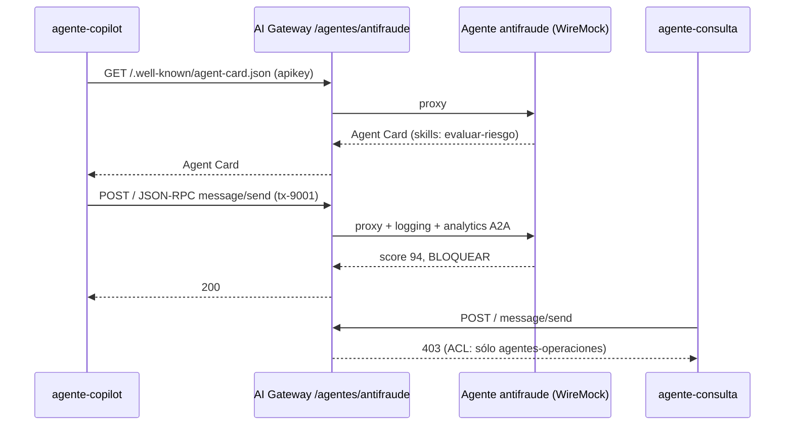

# Lab IA 07: A2A — un agente delega en otro a través del gateway

En este laboratorio publicarás el **agente antifraude** (protocolo A2A, simulado con WireMock) detrás del AI Gateway. El copiloto de operaciones podrá descubrirlo y delegarle la evaluación de una transferencia; el agente de consultas no.



## Objetivos

- Declarar una entidad `ai_gateway_agents` (`type: a2a`).
- Descubrir un agente por su **Agent Card** a través del gateway.
- Invocarlo con JSON-RPC (`message/send`).
- Verificar autenticación y ACL entre agentes.
- Ejercicio: publicar un segundo agente (scoring crediticio).

---

## Paso 1: Revisar la configuración y aplicar

`workshop-assets/dia-4/config/lab_07_a2a.yaml`:

```yaml
ai_gateway_agents:
  - ref: agente-antifraude
    ai_gateway: !ref lab-ai-gw#id
    type: a2a
    name: agente-antifraude
    display_name: Agente antifraude (A2A)
    access:
      auth_strategies: [!ref lab-key-auth#name]
      acls:
        allow: [agentes-operaciones]
    config:
      url: http://wiremock:8080/antifraude/
      route:
        paths: [/agentes/antifraude]
      logging: {payloads: true, statistics: true}
```

```bash
./workshop-assets/dia-4/scripts/aplicar.sh 07
source ~/.kong-workshop/aigw-lab/.env.generated
A2A=http://localhost:8010/agentes/antifraude
SEND='{"jsonrpc":"2.0","id":"1","method":"message/send","params":{"message":{"role":"user","messageId":"m-1","parts":[{"kind":"text","text":"Evaluar transferencia tx-9001: USD 5.500 a cuenta creada hace 2 h, 23:41 h."}]}}}'
```

## Paso 2: Descubrimiento (Agent Card)

```bash
curl -s -H "apikey: $AIGW_KEY_AGENTE_COPILOT" "$A2A/.well-known/agent-card.json" | jq '{name, url, skills: [.skills[].id]}'
```

**Resultado esperado:** `"name": "Agente Antifraude"` con la skill `evaluar-riesgo`.

## Paso 3: Delegación

```bash
curl -s -X POST "$A2A/" -H "apikey: $AIGW_KEY_AGENTE_COPILOT" -H "Content-Type: application/json" -d "$SEND" \
  | jq '.result.parts[0].data'
```

**Resultado esperado:**

```json
{
  "score_riesgo": 94,
  "recomendacion": "BLOQUEAR",
  "motivo": "Transferencia de alto monto a cuenta creada hace menos de 24 h, fuera del horario habitual del cliente."
}
```

## Paso 4: Gobierno del tráfico entre agentes

```bash
curl -s -o /dev/null -w "sin credencial:   %{http_code}\n" -X POST "$A2A/" -H "Content-Type: application/json" -d "$SEND"
curl -s -o /dev/null -w "agente-consulta:  %{http_code}\n" -X POST "$A2A/" -H "apikey: $AIGW_KEY_AGENTE_CONSULTA" -H "Content-Type: application/json" -d "$SEND"
curl -s -o /dev/null -w "agente-copilot:   %{http_code}\n" -X POST "$A2A/" -H "apikey: $AIGW_KEY_AGENTE_COPILOT" -H "Content-Type: application/json" -d "$SEND"
```

**Resultado esperado:** `401`, `403`, `200`.

En Konnect → **Analytics**: las interacciones A2A aparecen con su consumer y estadísticas.

## Paso 5: Juntar MCP + A2A (flujo del copiloto)

Simula el flujo completo de un copiloto de operaciones (los labs 06 y 07 deben estar aplicados):

```bash
mcp() { python3 workshop-assets/dia-4/scripts/mcp_client.py "$@"; }
# 1) LEER (MCP): últimas transacciones
mcp http://localhost:8010/mcp/banco "$AIGW_KEY_AGENTE_COPILOT" call listar_transacciones '{"cuenta_id":"1001"}' | jq -r '.result.content[0].text' | head -8
# 2) DELEGAR (A2A): evaluación de riesgo
REC=$(curl -s -X POST "$A2A/" -H "apikey: $AIGW_KEY_AGENTE_COPILOT" -H "Content-Type: application/json" -d "$SEND" | jq -r '.result.parts[0].data.recomendacion')
echo "Recomendación antifraude: $REC"
# 3) ACTUAR (MCP): bloquear sólo si corresponde
[ "$REC" = "BLOQUEAR" ] && mcp http://localhost:8010/mcp/banco "$AIGW_KEY_AGENTE_COPILOT" call bloquear_cuenta '{"cuenta_id":"1001"}' | jq -r '.result.content[0].text'
```

Los tres pasos pasaron por el gateway con la misma identidad (`agente-copilot`) y quedaron auditados.

## Paso 6: Ejercicio

WireMock también simula un **agente de scoring crediticio** en `http://wiremock:8080/scoring/`:

```bash
curl -s http://localhost:8089/scoring/.well-known/agent-card.json | jq '{name, skills: [.skills[].id]}'
```

Publícalo en el gateway en **`/agentes/scoring`**, accesible **sólo** para el grupo **`plan-premium`**. Aplica y verifica:

```bash
S=http://localhost:8010/agentes/scoring
SEND2='{"jsonrpc":"2.0","id":"2","method":"message/send","params":{"message":{"role":"user","messageId":"m-2","parts":[{"kind":"text","text":"Solicitud de préstamo personal USD 8.000 a 24 meses, ingreso neto USD 2.400."}]}}}'
curl -s -X POST "$S/" -H "apikey: $AIGW_KEY_EQUIPO_DATOS" -H "Content-Type: application/json" -d "$SEND2" | jq '.result.parts[0].data'   # 200
curl -s -o /dev/null -w "%{http_code}\n" -X POST "$S/" -H "apikey: $AIGW_KEY_APP_WEB" -H "Content-Type: application/json" -d "$SEND2"   # 403
```

??? tip "Solución"
    `workshop-assets/dia-4/soluciones/lab_07_a2a.yaml`:
    ```yaml
    - ref: agente-scoring
      ai_gateway: !ref lab-ai-gw#id
      type: a2a
      name: agente-scoring
      display_name: Agente de scoring crediticio (A2A)
      access:
        auth_strategies: [!ref lab-key-auth#name]
        acls:
          allow: [plan-premium]
      config:
        url: http://wiremock:8080/scoring/
        route:
          paths: [/agentes/scoring]
        logging: {payloads: true, statistics: true}
    ```
    `./workshop-assets/dia-4/scripts/aplicar.sh 07 --solucion`

---

## Conclusión

LLMs, tools MCP y agentes A2A comparten el mismo plano de control: identidad, ACL y auditoría. Ningún agente puede delegar en otro sin autorización explícita. Teoría: [Módulo IA 07](../dia-3-ai-gateway-teoria-y-demos/07-agentes-a2a/Guia_IA_07_Agentes_y_A2A.md). Siguiente: [Lab IA 08 — Observabilidad de IA](Lab_IA_08_Observabilidad.md).
