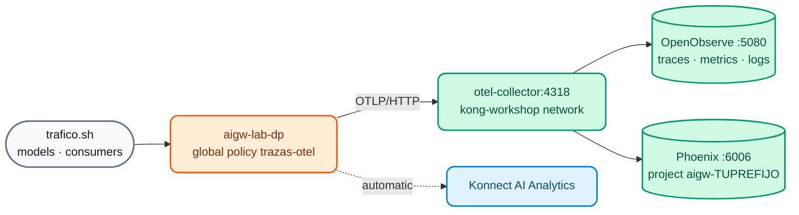

# AI Lab 08: AI Observability — OpenTelemetry, OpenObserve and Arize Phoenix

In this lab you will connect your AI Gateway to the **course observability stack** (OTel Collector + OpenObserve + Arize Phoenix, the same one used in [Day 2 Lab 07](../dia-2-labs/Lab_07_Observabilidad_Avanzada.md)) and analyze **real LLM traffic**: tokens, cost, latency per model and consumer, and the OpenInference spans with prompt and response in Phoenix. You will also review Konnect AI Analytics.



## Objectives

- Bring up the observability stack and connect the AI Gateway through the `kong-workshop` network.
- Apply the global `opentelemetry` policy with traces, AI metrics and logs.
- Analyze AI traces, metrics and logs in **OpenObserve**.
- See LLM spans (OpenInference) in **Arize Phoenix**.
- Answer **FinOps** questions with Konnect Analytics.
- Exercise: enrich the resource attributes and tune metric export.

---

## Step 1: Bring up the observability stack

```bash
./workshop-assets/dia-1/06-observability/scripts/setup-observability.sh
./workshop-assets/dia-1/06-observability/scripts/setup-observability.sh status
```

**Expected result:** `otel-collector`, `openobserve` and `phoenix` running; OpenObserve at `http://localhost:5080` and Phoenix at `http://localhost:6006`.

Check that your AI Data Plane can reach the Collector (both are on the `kong-workshop` network):

```bash
docker network inspect kong-workshop --format '{{range .Containers}}{{.Name}} {{end}}'
# ... aigw-lab-dp ... otel-collector ...
```

!!! note "Memory"
    The stack adds ~1.2 GB. If your machine is tight on memory, stop the Day 2 Data Plane (`docker stop kong-dp`) while you do this lab.

## Step 2: Review the policy and apply

`workshop-assets/dia-4/config/lab_08_observabilidad.yaml` declares the global policy `trazas-otel` (`type: opentelemetry`, `global: true`):

| Field | Value | Purpose |
| :--- | :--- | :--- |
| `traces_endpoint` / `logs_endpoint` | `http://otel-collector:4318/v1/traces` / `/v1/logs` | Traces and logs to the Collector |
| `metrics.endpoint` | `http://otel-collector:4318/v1/metrics` | OTLP metrics |
| `metrics.enable_ai_metrics` | `true` | AI metrics: tokens, cost, LLM latency |
| `metrics.enable_consumer_attribute` | `true` | Per-consumer attribution |
| `resource_attributes.service.name` | `aigw-TUPREFIJO` (`AIGW_OTEL_SERVICE_NAME`) | Filter in OpenObserve and project in Phoenix |

```bash
./workshop-assets/dia-4/scripts/aplicar.sh 08
```

## Step 3: Generate traffic

```bash
./workshop-assets/dia-4/scripts/trafico.sh 120
```

For 2 minutes, the script sends a variety of prompts to `chat`, `chat-cuotas`, `auto`, `asistente`, `chat-cache`, `codigo` and `chat-seguro` with different consumers. You will see `200`, and also `403` (ACL), `429` (quotas) and `400` (guardrails): all of it is useful information.

## Step 4: OpenObserve — AI traces, metrics and logs

1. Open `http://localhost:5080` (stack credentials: `admin@kong.com` / `Kong12345678!` by default, or those in `otel-stack/.env`).
2. **Traces** → stream `default` → *Past 15 minutes* → filter:

    ```sql
    service_name = 'aigw-TUPREFIJO'
    ```

    Open a `POST /v1/chat/completions` trace: you will see the gateway spans (authentication, policies, balancer) and the span for the model call. In the AI span's attributes, look for the **model**, the **provider** and the input/output **tokens**.

3. **Logs** → same filter. SQL mode:

    ```sql
    SELECT * FROM "default" WHERE service_name = 'aigw-TUPREFIJO' ORDER BY _timestamp DESC LIMIT 20
    ```

4. **Metrics** → expand the list and look for the AI metrics emitted by the gateway (tokens, cost, LLM latency) in addition to the request and latency metrics. Chart the tokens metric grouped by **model** and then by **consumer**.

5. **Dashboard (optional):** *Dashboards → New Dashboard* `TUPREFIJO IA` with two panels: "Tokens by consumer" and "LLM latency by model".

## Step 5: Arize Phoenix — the LLM view

1. Open `http://localhost:6006` → project **`aigw-TUPREFIJO`** (the Collector copies `service.name` as the project).
2. Open a `chat` trace: the LLM span shows the **model**, **input messages** (prompt), **response**, **tokens** and latency (OpenInference attributes from AI Gateway 2.2).
3. Open an **`asistente`** trace: the input messages include the `system` message with the **RAG context** injected by the gateway.
4. Open a **`chat-seguro`** trace: you can see the corporate policy `system` message added by the decorator.
5. Copy the `trace_id` and search for it in OpenObserve: it is **the same trace** (Collector *fan-out*).

## Step 6: FinOps with Konnect Analytics

In Konnect → **AI Gateway** → `TUPREFIJO-ai-gw` → **Analytics**, answer:

| Question | Hint |
| :--- | :--- |
| Which consumer used the most tokens in the last hour? | Group by consumer |
| What is the accumulated cost per model? | Cost calculated with the declared `input_cost` / `output_cost` (illustrative internal cost) |
| How many requests were blocked by guardrails or quotas? | Filter by status code `400` / `429` |
| Were there *cache hits* on `chat-cache`? | Cache metrics |
| How many MCP *tool calls* and A2A calls were there? | MCP / A2A traffic |

## Step 7: Exercise

Edit `lab_08_observabilidad.yaml`:

1. Add the resource attribute **`deployment.environment: workshop-ia`**.
2. Reduce the metrics export interval (`metrics.push_interval`) to **15 seconds**.

Apply, generate traffic (`trafico.sh 30`) and verify in OpenObserve that the new spans have `deployment_environment = 'workshop-ia'`:

```sql
service_name = 'aigw-TUPREFIJO' AND deployment_environment = 'workshop-ia'
```

??? tip "Solution"
    `workshop-assets/dia-4/soluciones/lab_08_observabilidad.yaml`:
    ```yaml
    metrics:
      push_interval: 15
    ...
    resource_attributes:
      service.name: !env AIGW_OTEL_SERVICE_NAME
      deployment.environment: workshop-ia
    ```
    `./workshop-assets/dia-4/scripts/aplicar.sh 08 --solucion`

!!! info "Beyond the lab (instructor demo)"
    - **Custom policy (2.2):** Lua published from Konnect without a rebuild (`X-Gobierno-IA`).
    - **Metering & Billing:** tokens per consumer → meter → plan → invoice (Konnect add-on).
    See [AI Module 08](../dia-3-ai-gateway-teoria-y-demos/08-observabilidad-finops/Guia_IA_08_Observabilidad_y_FinOps.md).

---

## Conclusion

With a single global policy, all AI traffic becomes observable using open standards (OTLP + OpenInference): OpenObserve for operations (traces, metrics, logs, alerts) and Phoenix for understanding model behavior. Konnect Analytics completes the FinOps view per consumer and model. Next: [AI Lab 09 — Challenge: governed credit assistant](Lab_IA_09_Desafio_Credito.md).
