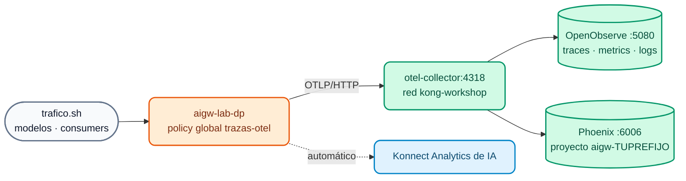

# Lab IA 08: Observabilidad de IA — OpenTelemetry, OpenObserve y Arize Phoenix

En este laboratorio conectarás tu AI Gateway al **stack de observabilidad del curso** (OTel Collector + OpenObserve + Arize Phoenix, el mismo del [Lab 07 del Día 2](../dia-2-labs/Lab_07_Observabilidad_Avanzada.md)) y analizarás tráfico **real de LLM**: tokens, costo, latencia por modelo y consumer, y los spans OpenInference con prompt y respuesta en Phoenix. También revisarás Konnect Analytics de IA.



## Objetivos

- Levantar el stack de observabilidad y conectar el AI Gateway por la red `kong-workshop`.
- Aplicar la policy global `opentelemetry` con trazas, métricas de IA y logs.
- Analizar trazas, métricas y logs de IA en **OpenObserve**.
- Ver spans de LLM (OpenInference) en **Arize Phoenix**.
- Responder preguntas de **FinOps** con Konnect Analytics.
- Ejercicio: enriquecer los atributos de recurso y ajustar el envío de métricas.

---

## Paso 1: Levantar el stack de observabilidad

```bash
./workshop-assets/dia-1/06-observability/scripts/setup-observability.sh
./workshop-assets/dia-1/06-observability/scripts/setup-observability.sh status
```

**Resultado esperado:** `otel-collector`, `openobserve` y `phoenix` en ejecución; OpenObserve en `http://localhost:5080` y Phoenix en `http://localhost:6006`.

Comprueba que tu Data Plane de IA alcanza al Collector (ambos están en la red `kong-workshop`):

```bash
docker network inspect kong-workshop --format '{{range .Containers}}{{.Name}} {{end}}'
# ... aigw-lab-dp ... otel-collector ...
```

!!! note "Memoria"
    El stack suma ~1,2 GB. Si tu máquina va justa, detén el Data Plane del Día 2 (`docker stop kong-dp`) mientras haces este lab.

## Paso 2: Revisar la policy y aplicar

`workshop-assets/dia-4/config/lab_08_observabilidad.yaml` declara la policy global `trazas-otel` (`type: opentelemetry`, `global: true`):

| Campo | Valor | Para qué |
| :--- | :--- | :--- |
| `traces_endpoint` / `logs_endpoint` | `http://otel-collector:4318/v1/traces` / `/v1/logs` | Trazas y logs al Collector |
| `metrics.endpoint` | `http://otel-collector:4318/v1/metrics` | Métricas OTLP |
| `metrics.enable_ai_metrics` | `true` | Métricas de IA: tokens, costo, latencia del LLM |
| `metrics.enable_consumer_attribute` | `true` | Atribución por consumer |
| `resource_attributes.service.name` | `aigw-TUPREFIJO` (`AIGW_OTEL_SERVICE_NAME`) | Filtro en OpenObserve y proyecto en Phoenix |

```bash
./workshop-assets/dia-4/scripts/aplicar.sh 08
```

## Paso 3: Generar tráfico

```bash
./workshop-assets/dia-4/scripts/trafico.sh 120
```

El script envía, durante 2 minutos, prompts variados a `chat`, `chat-cuotas`, `auto`, `asistente`, `chat-cache`, `codigo` y `chat-seguro` con distintos consumers. Verás `200`, y también `403` (ACL), `429` (cuotas) y `400` (guardrails): todo es información útil.

## Paso 4: OpenObserve — trazas, métricas y logs de IA

1. Abre `http://localhost:5080` (credenciales del stack: `admin@kong.com` / `Kong12345678!` por defecto, o las de `otel-stack/.env`).
2. **Traces** → stream `default` → *Past 15 minutes* → filtro:

    ```sql
    service_name = 'aigw-TUPREFIJO'
    ```

    Abre una traza de `POST /v1/chat/completions`: verás los spans del gateway (autenticación, policies, balancer) y el de la llamada al modelo. En los atributos del span de IA busca el **modelo**, el **proveedor** y los **tokens** de entrada/salida.

3. **Logs** → mismo filtro. Modo SQL:

    ```sql
    SELECT * FROM "default" WHERE service_name = 'aigw-TUPREFIJO' ORDER BY _timestamp DESC LIMIT 20
    ```

4. **Metrics** → despliega la lista y busca las métricas de IA emitidas por el gateway (tokens, costo, latencia de LLM) además de las de peticiones y latencia. Grafica la de tokens agrupando por **modelo** y luego por **consumer**.

5. **Dashboard (opcional):** *Dashboards → New Dashboard* `TUPREFIJO IA` con dos paneles: "Tokens por consumer" y "Latencia de LLM por modelo".

## Paso 5: Arize Phoenix — la vista del LLM

1. Abre `http://localhost:6006` → proyecto **`aigw-TUPREFIJO`** (el Collector copia `service.name` como proyecto).
2. Abre una traza de `chat`: el span de LLM muestra **modelo**, **mensajes de entrada** (prompt), **respuesta**, **tokens** y latencia (atributos OpenInference de AI Gateway 2.2).
3. Abre una traza de **`asistente`**: en los mensajes de entrada aparece el `system` con el **contexto RAG** inyectado por el gateway.
4. Abre una de **`chat-seguro`**: se ve el `system` de la política corporativa agregado por el decorator.
5. Copia el `trace_id` y búscalo en OpenObserve: es **la misma traza** (*fan-out* del Collector).

## Paso 6: FinOps con Konnect Analytics

En Konnect → **AI Gateway** → `TUPREFIJO-ai-gw` → **Analytics** responde:

| Pregunta | Pista |
| :--- | :--- |
| ¿Qué consumer consumió más tokens en la última hora? | Agrupar por consumer |
| ¿Cuál es el costo acumulado por modelo? | Costo calculado con `input_cost` / `output_cost` declarados (costo interno ilustrativo) |
| ¿Cuántas peticiones fueron bloqueadas por guardrails o cuotas? | Filtrar por código `400` / `429` |
| ¿Hubo *cache hits* en `chat-cache`? | Métricas de caché |
| ¿Cuántas *tool calls* MCP y llamadas A2A hubo? | Tráfico MCP / A2A |

## Paso 7: Ejercicio

Edita `lab_08_observabilidad.yaml`:

1. Agrega el atributo de recurso **`deployment.environment: workshop-ia`**.
2. Reduce el intervalo de envío de métricas (`metrics.push_interval`) a **15 segundos**.

Aplica, genera tráfico (`trafico.sh 30`) y verifica en OpenObserve que los spans nuevos tienen `deployment_environment = 'workshop-ia'`:

```sql
service_name = 'aigw-TUPREFIJO' AND deployment_environment = 'workshop-ia'
```

??? tip "Solución"
    `workshop-assets/dia-4/soluciones/lab_08_observabilidad.yaml`:
    ```yaml
    metrics:
      push_interval: 15
    ...
    resource_attributes:
      service.name: !env AIGW_OTEL_SERVICE_NAME
      deployment.environment: workshop-ia
    ```
    `./workshop-assets/dia-4/scripts/aplicar.sh 08 --solucion`

!!! info "Más allá del lab (demo del instructor)"
    - **Custom policy (2.2):** Lua publicado desde Konnect sin rebuild (`X-Gobierno-IA`).
    - **Metering & Billing:** tokens por consumer → meter → plan → factura (add-on de Konnect).
    Ver el [Módulo IA 08](../dia-3-ai-gateway-teoria-y-demos/08-observabilidad-finops/Guia_IA_08_Observabilidad_y_FinOps.md).

---

## Conclusión

Con una sola policy global, todo el tráfico de IA queda observable con estándares abiertos (OTLP + OpenInference): OpenObserve para operar (trazas, métricas, logs, alertas) y Phoenix para entender el comportamiento de los modelos. Konnect Analytics completa la visión de FinOps por consumer y modelo. Siguiente: [Lab IA 09 — Desafío: asistente de crédito gobernado](Lab_IA_09_Desafio_Credito.md).
