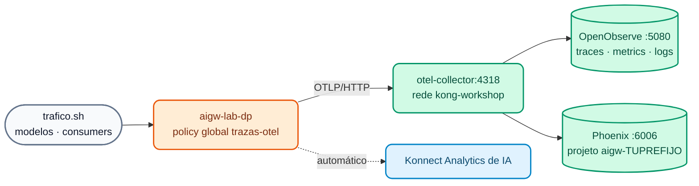

# Lab IA 08: Observabilidade de IA — OpenTelemetry, OpenObserve e Arize Phoenix

Neste laboratório você vai conectar o seu AI Gateway ao **stack de observabilidade do curso** (OTel Collector + OpenObserve + Arize Phoenix, o mesmo do [Lab 07 do Dia 2](../dia-2-labs/Lab_07_Observabilidad_Avanzada.md)) e analisar tráfego **real de LLM**: tokens, custo, latência por modelo e por consumer, e os spans OpenInference com prompt e resposta no Phoenix. Você também vai revisar o Konnect Analytics de IA.



## Objetivos

- Subir o stack de observabilidade e conectar o AI Gateway pela rede `kong-workshop`.
- Aplicar a policy global `opentelemetry` com traces, métricas de IA e logs.
- Analisar traces, métricas e logs de IA no **OpenObserve**.
- Ver spans de LLM (OpenInference) no **Arize Phoenix**.
- Responder perguntas de **FinOps** com o Konnect Analytics.
- Exercício: enriquecer os atributos de recurso e ajustar o envio de métricas.

---

## Passo 1: Subir o stack de observabilidade

```bash
./workshop-assets/dia-1/06-observability/scripts/setup-observability.sh
./workshop-assets/dia-1/06-observability/scripts/setup-observability.sh status
```

**Resultado esperado:** `otel-collector`, `openobserve` e `phoenix` em execução; OpenObserve em `http://localhost:5080` e Phoenix em `http://localhost:6006`.

Verifique se o seu Data Plane de IA alcança o Collector (ambos estão na rede `kong-workshop`):

```bash
docker network inspect kong-workshop --format '{{range .Containers}}{{.Name}} {{end}}'
# ... aigw-lab-dp ... otel-collector ...
```

!!! note "Memória"
    O stack consome ~1,2 GB. Se a sua máquina estiver no limite, pare o Data Plane do Dia 2 (`docker stop kong-dp`) enquanto faz este lab.

## Passo 2: Revisar a policy e aplicar

`workshop-assets/dia-4/config/lab_08_observabilidad.yaml` declara a policy global `trazas-otel` (`type: opentelemetry`, `global: true`):

| Campo | Valor | Para quê |
| :--- | :--- | :--- |
| `traces_endpoint` / `logs_endpoint` | `http://otel-collector:4318/v1/traces` / `/v1/logs` | Traces e logs para o Collector |
| `metrics.endpoint` | `http://otel-collector:4318/v1/metrics` | Métricas OTLP |
| `metrics.enable_ai_metrics` | `true` | Métricas de IA: tokens, custo, latência do LLM |
| `metrics.enable_consumer_attribute` | `true` | Atribuição por consumer |
| `resource_attributes.service.name` | `aigw-TUPREFIJO` (`AIGW_OTEL_SERVICE_NAME`) | Filtro no OpenObserve e projeto no Phoenix |

```bash
./workshop-assets/dia-4/scripts/aplicar.sh 08
```

## Passo 3: Gerar tráfego

```bash
./workshop-assets/dia-4/scripts/trafico.sh 120
```

O script envia, durante 2 minutos, prompts variados para `chat`, `chat-cuotas`, `auto`, `asistente`, `chat-cache`, `codigo` e `chat-seguro` com diferentes consumers. Você verá `200`, e também `403` (ACL), `429` (cotas) e `400` (guardrails): tudo isso é informação útil.

## Passo 4: OpenObserve — traces, métricas e logs de IA

1. Abra `http://localhost:5080` (credenciais do stack: `admin@kong.com` / `Kong12345678!` por padrão, ou as de `otel-stack/.env`).
2. **Traces** → stream `default` → *Past 15 minutes* → filtro:

    ```sql
    service_name = 'aigw-TUPREFIJO'
    ```

    Abra um trace de `POST /v1/chat/completions`: você verá os spans do gateway (autenticação, policies, balancer) e o da chamada ao modelo. Nos atributos do span de IA, procure o **modelo**, o **provedor** e os **tokens** de entrada/saída.

3. **Logs** → mesmo filtro. Modo SQL:

    ```sql
    SELECT * FROM "default" WHERE service_name = 'aigw-TUPREFIJO' ORDER BY _timestamp DESC LIMIT 20
    ```

4. **Metrics** → expanda a lista e procure as métricas de IA emitidas pelo gateway (tokens, custo, latência de LLM), além das de requisições e latência. Crie um gráfico da métrica de tokens agrupando por **modelo** e depois por **consumer**.

5. **Dashboard (opcional):** *Dashboards → New Dashboard* `TUPREFIJO IA` com dois painéis: "Tokens por consumer" e "Latência de LLM por modelo".

## Passo 5: Arize Phoenix — a visão do LLM

1. Abra `http://localhost:6006` → projeto **`aigw-TUPREFIJO`** (o Collector copia `service.name` como projeto).
2. Abra um trace de `chat`: o span de LLM mostra **modelo**, **mensagens de entrada** (prompt), **resposta**, **tokens** e latência (atributos OpenInference do AI Gateway 2.2).
3. Abra um trace de **`asistente`**: nas mensagens de entrada aparece o `system` com o **contexto RAG** injetado pelo gateway.
4. Abra um de **`chat-seguro`**: dá para ver o `system` da política corporativa adicionado pelo decorator.
5. Copie o `trace_id` e procure-o no OpenObserve: é **o mesmo trace** (*fan-out* do Collector).

## Passo 6: FinOps com o Konnect Analytics

No Konnect → **AI Gateway** → `TUPREFIJO-ai-gw` → **Analytics**, responda:

| Pergunta | Dica |
| :--- | :--- |
| Qual consumer consumiu mais tokens na última hora? | Agrupar por consumer |
| Qual é o custo acumulado por modelo? | Custo calculado com os `input_cost` / `output_cost` declarados (custo interno ilustrativo) |
| Quantas requisições foram bloqueadas por guardrails ou cotas? | Filtrar pelo código `400` / `429` |
| Houve *cache hits* em `chat-cache`? | Métricas de cache |
| Quantas *tool calls* MCP e chamadas A2A houve? | Tráfego MCP / A2A |

## Passo 7: Exercício

Edite `lab_08_observabilidad.yaml`:

1. Adicione o atributo de recurso **`deployment.environment: workshop-ia`**.
2. Reduza o intervalo de envio de métricas (`metrics.push_interval`) para **15 segundos**.

Aplique, gere tráfego (`trafico.sh 30`) e verifique no OpenObserve que os novos spans têm `deployment_environment = 'workshop-ia'`:

```sql
service_name = 'aigw-TUPREFIJO' AND deployment_environment = 'workshop-ia'
```

??? tip "Solução"
    `workshop-assets/dia-4/soluciones/lab_08_observabilidad.yaml`:
    ```yaml
    metrics:
      push_interval: 15
    ...
    resource_attributes:
      service.name: !env AIGW_OTEL_SERVICE_NAME
      deployment.environment: workshop-ia
    ```
    `./workshop-assets/dia-4/scripts/aplicar.sh 08 --solucion`

!!! info "Além do lab (demo do instrutor)"
    - **Custom policy (2.2):** Lua publicado a partir do Konnect sem rebuild (`X-Gobierno-IA`).
    - **Metering & Billing:** tokens por consumer → meter → plano → fatura (add-on do Konnect).
    Veja o [Módulo IA 08](../dia-3-ai-gateway-teoria-y-demos/08-observabilidad-finops/Guia_IA_08_Observabilidad_y_FinOps.md).

---

## Conclusão

Com uma única policy global, todo o tráfego de IA fica observável com padrões abertos (OTLP + OpenInference): OpenObserve para operar (traces, métricas, logs, alertas) e Phoenix para entender o comportamento dos modelos. O Konnect Analytics completa a visão de FinOps por consumer e modelo. Próximo: [Lab IA 09 — Desafio: assistente de crédito governado](Lab_IA_09_Desafio_Credito.md).
