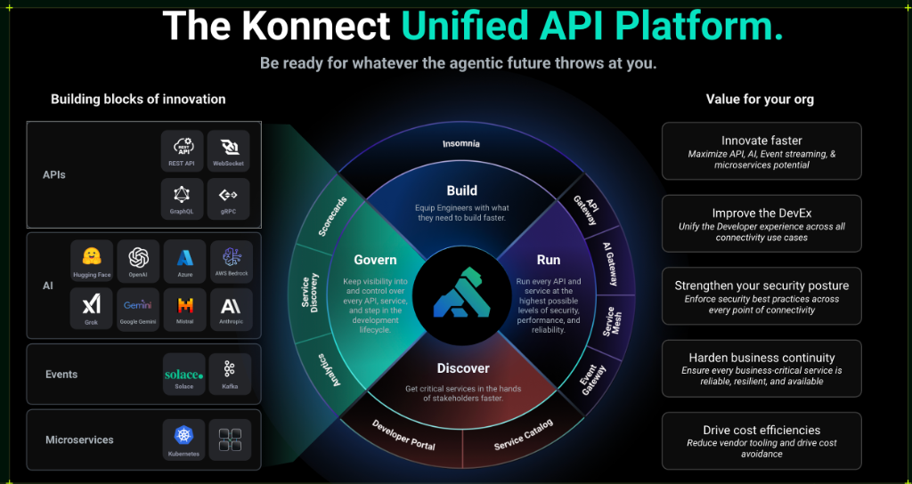

# Kong API Gateway & Konnect Workshop

Welcome to the official workshop material for **Kong API Gateway & Konnect**.
This two-day in-person course is designed to provide practical training in API Gateway, GitOps, Security, and Observability.

---

## Description and Objectives

The entire workshop uses a **GitOps** approach with declarative management via **decK**, automation with **Terraform**, and simulated backends with Docker.

### Test Backend: httpbin
As the common thread for our practices and demonstrations, we will use **httpbin** as our simulated test backend. In our local environment, this service is already pre-deployed via Docker (in the `httpbin-backend` container). `httpbin` is a widely used generic tool for testing HTTP requests; it allows us to easily verify which headers, methods, and message bodies are effectively reaching the backend after passing through the API Gateway.

Our work during the workshop will be to expose, secure, and manage traffic to these test APIs using Kong Konnect, allowing us to focus on routing, transformations, and security policies without relying on complex business logic in the backend.

### Day 1: Theoretical Block — Fundamentals, Operations, and Security
**Comprehensive Kong Konnect Theory**

- **Conceptual Architecture**: Understanding the separation of Control Plane (Konnect) and Data Plane (Kong Gateway based on NGINX/OpenResty), and communication via gRPC mTLS tunnel.
- **Developer Track**: Concepts of Gateway Services, Routes, Plugins, Developer Portal, and publishing Catalog APIs.
- **Operations Track**: Declarative governance with decK/Terraform, traffic monitoring, and advanced observability with OpenTelemetry (OpenObserve + Arize Phoenix).
- **Security Track**: Zero Trust strategies, OIDC, RBAC, and access control using OPA.

### Day 2: Practical Block — Hands-On Labs and Final Challenge
**Guided Labs and Practice**

- **Setup and Routing**: Local environment initialization and declarative route deployment.
- **Plugins and Portals**: Payload transformations, intelligent routing, and OAS catalog publishing.
- **Operations and Security**: Local observability deployment (OTel Collector + OpenObserve + Phoenix), Key Auth application, IP restriction, and OIDC.
- **Event Gateway**: Asynchronous integration by sending messages to Kafka topics (Event-Driven Architecture).

---

## Full Workshop Agenda

The workshop is planned over two structured sessions from **08:00 to 17:00**:

### Day 1: Theory and Demonstrations
| Time | Block | Topic / Module |
|---------|--------|---------------|
| **08:00 - 08:30** | Morning (All) | Welcome, Architecture, and Conceptual Setup |
| **08:30 - 09:15** | Morning (Dev) | Module 00: Conceptual Architecture and Local Setup |
| **09:15 - 10:15** | Morning (Dev) | Module 01: Kong Konnect Gateway & Control Planes |
| **10:15 - 10:30** | - | *Coffee Break* |
| **10:30 - 12:00** | Morning (Dev) | Module 02: Kong Plugins Ecosystem |
| **12:00 - 13:00** | Morning (Dev) | Module 03: Developer Portal, Customization, and Onboarding |
| **13:00 - 14:15** | - | *Lunch (Devs depart)* |
| **14:15 - 15:15** | Afternoon (Ops) | Module 04: Gateway Operations & GitOps (decK / Terraform) |
| **15:15 - 15:45** | Afternoon (Ops) | Module 05: Monitoring and Logging (Konnect Analytics) |
| **15:45 - 16:00** | - | *Coffee Break* |
| **16:00 - 16:45** | Afternoon (Ops) | Module 06: Advanced Observability (OpenTelemetry / OpenObserve / Phoenix) |
| **16:45 - 17:30** | Afternoon (Sec) | Module 07: Securing API Traffic (Key Auth, ACL, OIDC, IP Restriction) |
| **17:30 - 17:45** | Afternoon (All) | **Environment Health Check** (Day 2 Preparation) |

### Day 2: Practical — Hands-On Labs and Closing
| Time | Block | Lab / Practical Activity |
|---------|--------|----------------------------------|
| **08:00 - 08:15** | Morning (All) | Welcome to Practical Day, credentials, and GitOps review |
| **08:15 - 09:00** | Morning (Dev) | **Lab:** Local Environment Setup |
| **09:00 - 09:50** | Morning (Dev) | **Lab:** Declarative Routing + Upstreams & Health Checks |
| **09:50 - 10:05** | - | *Coffee Break* |
| **10:05 - 11:20** | Morning (Dev) | **Lab:** Catalog APIs & OAS + Transformations |
| **11:20 - 12:00** | Morning (Dev) | **Advanced Labs:** Intelligent Routing and JSON Validation |
| **12:00 - 13:00** | - | *Lunch (Devs depart / Ops arrive)* |
| **13:00 - 13:15** | Afternoon (All) | Welcome and environment synchronization (Afternoon arrivals) |
| **13:15 - 14:15** | Afternoon (Ops) | **Lab:** Distributed Observability with OTel, OpenObserve, and Phoenix |
| **14:15 - 15:25** | Afternoon (Sec) | **Lab:** Zero Trust Key Auth + OIDC & ACL |
| **15:25 - 15:40** | - | *Coffee Break* |
| **15:40 - 16:25** | Afternoon (Sec) | **Lab:** IP Restriction + OPA Authorization |
| **16:25 - 17:00** | Afternoon (All) | Workshop closing, Q&A, and next steps |